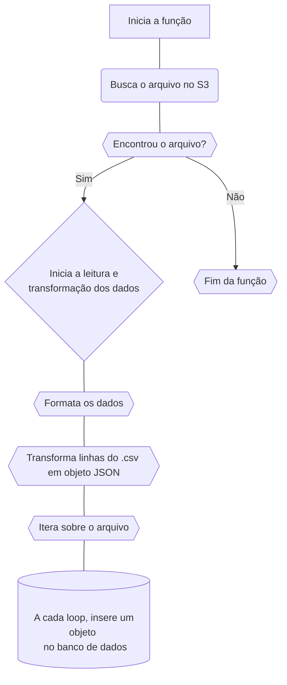

<p align="center">
  
</p>

# Lambda | ETL

Está é uma função lambda que faz a extração, transformação e carregamento de dados de um arquivo .csv para um banco de dados PostgreSQL.

## Como funciona?



##

Para vermos isso na prática, temos duas maneiras de executar a função lambda: **_localmente_** e através do **_Cloud9_** na AWS.

### Executando localmente

```bash
# Clone este repositório
$ git clone https://github.com/rafaeelricco/lambda-etl.git

# Acesse a pasta do projeto no terminal/cmd
$ cd lambda-etl

# Instale as dependências
$ pip install -r requirements.txt

# Crie um arquivo .env na raiz do projeto
$ touch .env

# Adicione as seguintes variáveis de ambiente
DB_HOST=<your_host>
DB_PORT=<your_port>
DB_NAME=<your_db_name>
DB_PASSWORD=<your_password>
DB_USER=<your_user>

# Credentials of AWS
AWS_ACCESS_KEY_ID=<your_access_key>
AWS_SECRET_ACCESS_KEY=<your_secret_key>

# Após adicionar as variáveis de ambiente, execute o comando abaixo
$ source .env

# Execute a aplicação
$ python lambda_function.py
```

### Cloud9

```bash
# Clone este repositório ou apenas copie o código da função lambda
$ git clone

Importânte: certifique-se de estar na região us-east-1 para não ter problemas com as layers.

# Acesse o lambda da AWS e crie uma nova função lambda (Python 3.8)(x86_64)

# Clique em "Create function"

Agora usaremos duas layers para prover as dependências da função lambda.

# Clique em "Layers"

# Clique em "Create Layer"

# Clique em "Provide a layer version ARN"

# Cole os seguintes ARNs:

arn:aws:lambda:us-east-1:898466741470:layer:psycopg2-py38:2
arn:aws:lambda:us-east-1:336392948345:layer:AWSSDKPandas-Python38:1

# Crie um evento para a função lambda

# Vá em test e configure um evento

# Clique em salvar

# Vá no editor de código da função lambda

# Cole o código da função lambda

# Clique em "Deploy" para salvar a função

# Clique em "Test" para executar a função

# No output você verá algo como:
```


## Verificando no banco de dados

```bash
# Execute a query abaixo para ver os dados
SELECT * FROM cessao_fundo

# Você verá algo como:
```


